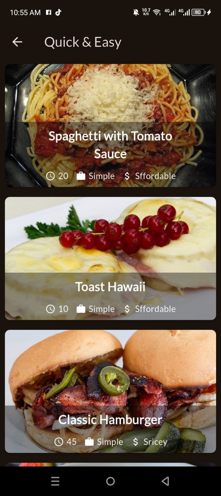
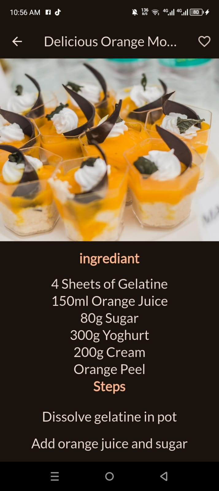
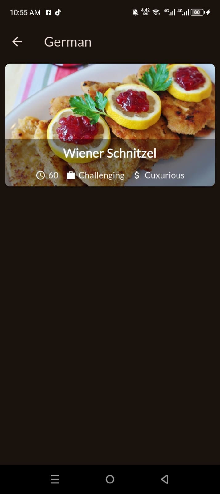

# 🍽️ Meal App

A Flutter-based Meal App that allows users to explore meals by category, view detailed information, and filter based on dietary preferences. Built to practice and demonstrate state management, navigation, and UI building in Flutter.

---

## 📸 App Screenshots

<table>
  <tr>
    <td align="center"><b>🏠 Home Screen</b></td>
    <td align="center"><b>➕ Add Expense</b></td>
  </tr>
  <tr>
    <td></td>
    <td></td>
  </tr>
  <tr>
    <td align="center"><b>📊 Chart View</b></td>
    <td align="center"><b>🗑️ Edit/Delete</b></td>
  </tr>
  <tr>
    <td></td>
    <td></td>
  </tr>
  <tr>
    <td align="center"><b>🔍 Filter Screen</b></td>
    <td align="center"><b>⚙️ Settings</b></td>
  </tr>
  <tr>
    <td></td>
    <td></td>
  </tr>
</table>

## 📁 Folder Structure

```plaintext
lib/
├── data/
│   └── dummy_data.dart
├── models/
│   ├── category.dart
│   └── meal.dart
├── providers/
│   ├── filters_provider.dart
│   ├── favorites_provider.dart
│   └── meals_provider.dart
├── screens/
│   ├── categories.dart
│   ├── meal_details.dart
│   ├── meals.dart
│   ├── tabs.dart
│   └── filters.dart
├── widgets/
│   ├── category_grid_item.dart
│   ├── meal_item.dart
│   ├── meal_item_trait.dart
│   └── main_drawer.dart
└── main.dart


---
## 🚀 Features

- 🧾 Browse meals by category
- 📄 View detailed recipe, ingredients, and steps
- ❤️ Add/remove favorite meals
- ✅ Apply filters for:
  - Gluten-free
  - Lactose-free
  - Vegan
  - Vegetarian
- 🔄 Persistent filters using state management
- 📱 Clean and user-friendly UI

---

## 🧑‍💻 Developer

Made with ❤️ by Sohaib Ahmed Farooqi as a Flutter learning project.
