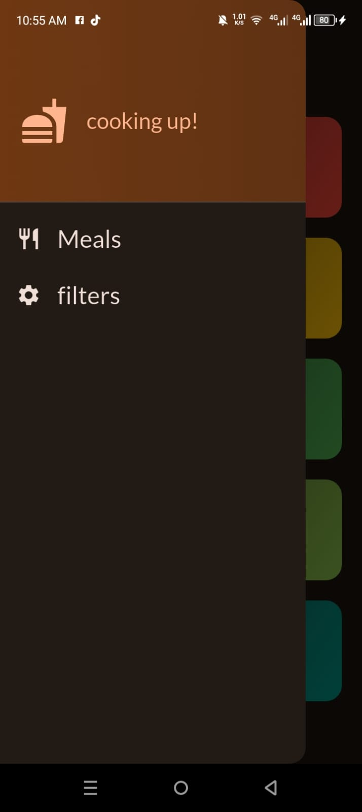
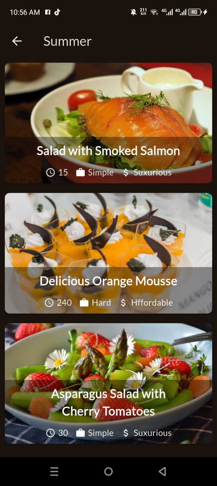

# 🍽️ Meal App

A Flutter-based Meal App that allows users to explore meals by category, view detailed information, and filter based on dietary preferences. Built to practice and demonstrate state management, navigation, and UI building in Flutter.

---

## 📁 Folder Structure

```plaintext
lib/
├── data/
│   └── dummy_data.dart
├── models/
│   ├── category.dart
│   └── meal.dart
├── providers/
│   ├── filters_provider.dart
│   ├── favorites_provider.dart
│   └── meals_provider.dart
├── screens/
│   ├── categories.dart
│   ├── meal_details.dart
│   ├── meals.dart
│   ├── tabs.dart
│   └── filters.dart
├── widgets/
│   ├── category_grid_item.dart
│   ├── meal_item.dart
│   ├── meal_item_trait.dart
│   └── main_drawer.dart
└── main.dart
---

## 📸 App Screenshots

<table>
  <tr>
    <td align="center" style="padding-right: 40px; padding-bottom: 20px;">
      <br/>
      <strong>🏠 Home Screen</strong>
    </td>
    <td align="center" style="padding-left: 40px; padding-bottom: 20px;">
      <br/>
      <strong>➕ Add Expense</strong>
    </td>
  </tr>
  <tr>
    <td align="center" style="padding-right: 40px; padding-top: 20px;">
      <br/>
      <strong>📊 Chart View</strong>
    </td>
    <td align="center" style="padding-left: 40px; padding-top: 20px;">
      <br/>
      <strong>🗑️ Edit/Delete</strong>
    </td>
  </tr>
  <tr>
    <td align="center" style="padding-right: 40px; padding-top: 20px;">
      <br/>
      <strong>🔍 Filter Screen</strong>
    </td>
    <td align="center" style="padding-left: 40px; padding-top: 20px;">
      <br/>
      <strong>⚙️ Settings</strong>
    </td>
  </tr>
</table>
---

